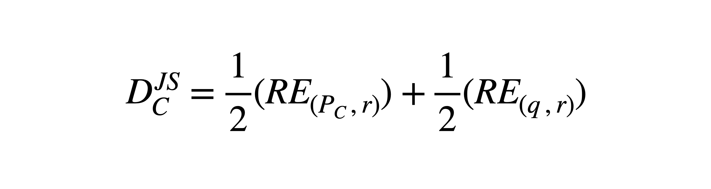
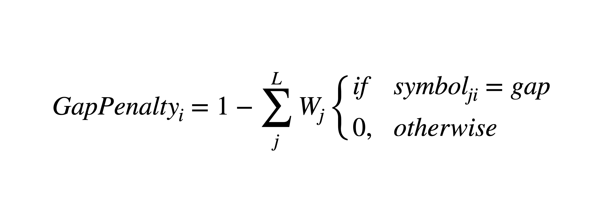
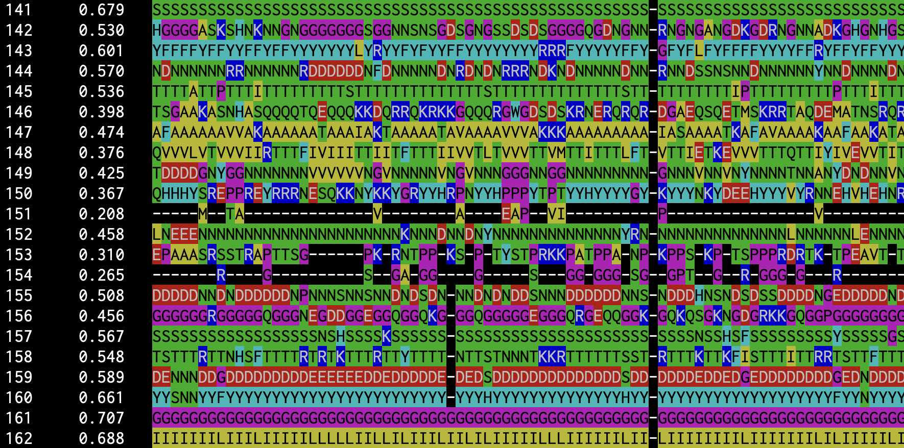

# cons-capra07 
A Rust program that calculates conservation score a site in a Multiple Sequence Alignment (MSA) using Jensen-Shannon divergence. 

[](https://github.com/shin-kinos/cons-capra07/releases/tag/v1.1.1) [](https://github.com/shin-kinos/cons-capra07/blob/main/LICENSE) 

## Description 
* This program scores residue conservation in each site on a MSA. 
* The scoring measure is based on Jensen-Shannon divergence (JSD) applied by Capra and Singh [1]. 
* It takes account of background distribution, sequence weighting and gap penalty. 

## Dependencies 

* `colored` ( https://github.com/mackwic/colored ) 

**Update 01/05/2022 : From `v1.1.0`, the crate `colored` is not required anymore.**

``` 
[dependencies]
colored = "2.0"
``` 


## Installation 

You can compile this program by using `Cargo`. 📦🦀

[e. g.] 

``` 
% cd cons-capra07-main
% cargo build --release
``` 
Then the object file is generated in `./target/release` directory. 

## Scoring method 

### Conservation score 

The conservation score is calculated based on JSD as follows: 



where ***Pc*** is a site distribution, ***q*** is a background distribution, ***r = (Pc + q) / 2*** and ***RE*** is the Relative Entropy (RE). 

⚠️ NOTE that gaps are ignored in calculating site distributions.

### Sequence weighting 
This program supports two types of sequence weighting: 

1. The Position-Based method by Henikoff and Henikoff [2].
2. The Distance-Based method by Vingron and Argos [3]. 

### Gap penalty 
The gap penalties are given as follows:



where ***L*** is the length of a site (or number of the sequences in the MSA) and ***Wj*** is the weighting factor of sequence ***j***. The gap penalty of site ***i*** is given by calculating sum of weighting factors assigned to the gaps in sequence ***j***. 

### Background distribution 

The RE requires a background distribution. In this program, there are nine background distributions you can choose: 

1. BLOSUM62 [4] 
2. AA composition of Swiss-Prot (from UniProt Knowledge Base) 
3. AA composition in extracellular proteins [5]
4. AA composition in membrane proteins [5]
5. AA composition in intracellular proteins [5] 
6. JTT [6] 
7. WAG [7] 
8. LG [8] 
9. Non-biassed distribution (equal rate at 0.05)  

Gaps are ignored as well as site distributions.  

## Input file format
Aligned Multi-FASTA format of amino acid sequences. 

⚠️ NOTE that nucleotide sequences are not supported. 

See some example input files in `demo` directory. 

## Usage
Major arguments:

`-i` : Input filename in aligned Multi-FASTA format, REQUIRED.

`-o` : Output filename, REQUIRED.

`-w` : Method of sequence weighting ( "hen" or "va", default "hen" ).

`-b` : Background distribution (default "blosum62").

[e. g.]

```
% ./cons-capra07 -i input.fasta -o output.txt -w va -c yes -t no
```
Type `-h` to see other available options.

## Output

Number`\t`Conservation score`\t`Composition of the site

[e.g.] 



## References 
1. Capra, John A., and Mona Singh. "Predicting functionally important residues from sequence conservation." Bioinformatics 23.15 (2007): 1875-1882.
2. Henikoff, Steven, and Jorja G. Henikoff. "Position-based sequence weights." Journal of molecular biology 243.4 (1994): 574-578. 
3. Vingron, Martin, and Patrick Argos. "A fast and sensitive multiple sequence alignment algorithm." Bioinformatics 5.2 (1989): 115-121. 
4. Henikoff, Steven, and Jorja G. Henikoff. "Amino acid substitution matrices from protein blocks." Proceedings of the National Academy of Sciences 89.22 (1992): 10915-10919. 
5. Cedano, Juan, et al. "Relation between amino acid composition and cellular location of proteins." Journal of molecular biology 266.3 (1997): 594-600. 
6. Jones, David T., William R. Taylor, and Janet M. Thornton. "The rapid generation of mutation data matrices from protein sequences." Bioinformatics 8.3 (1992): 275-282. 
7. Whelan, Simon, and Nick Goldman. "A general empirical model of protein evolution derived from multiple protein families using a maximum-likelihood approach." Molecular biology and evolution 18.5 (2001): 691-699. 
8. Le, Si Quang, and Olivier Gascuel. "An improved general amino acid replacement matrix." Molecular biology and evolution 25.7 (2008): 1307-1320. 
